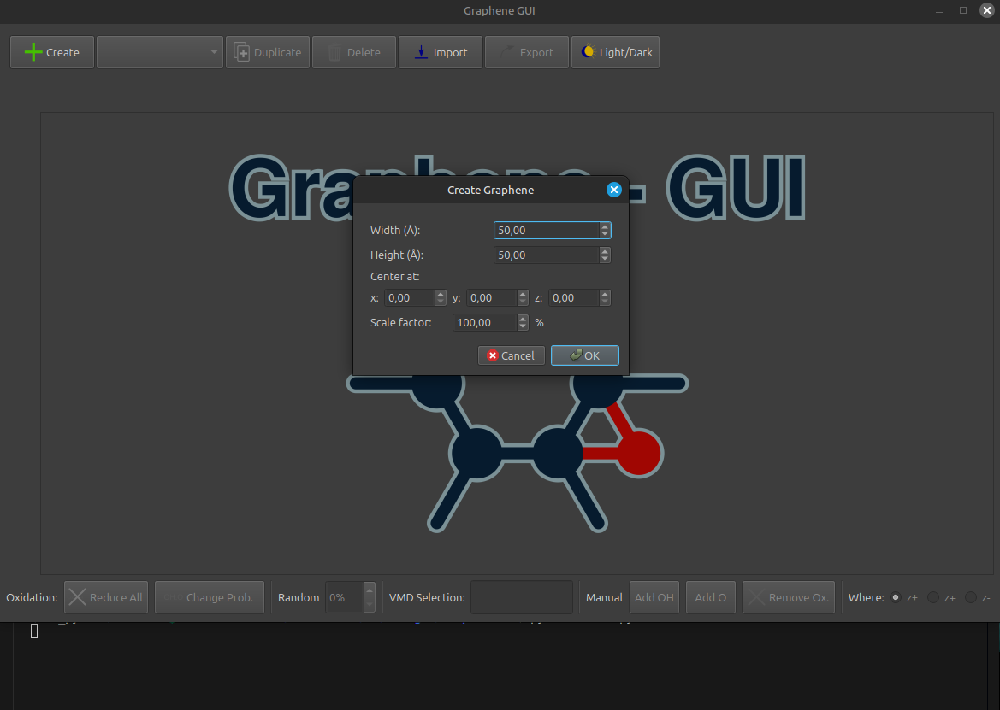
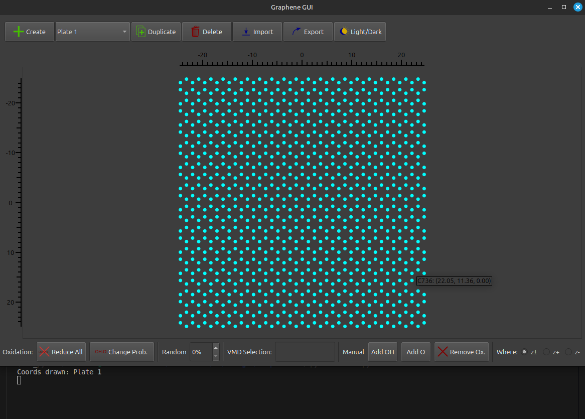
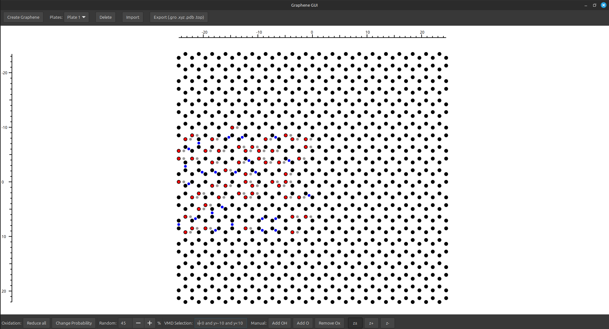
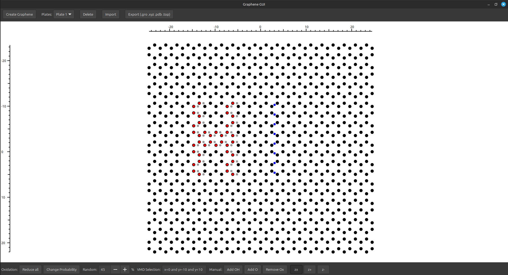
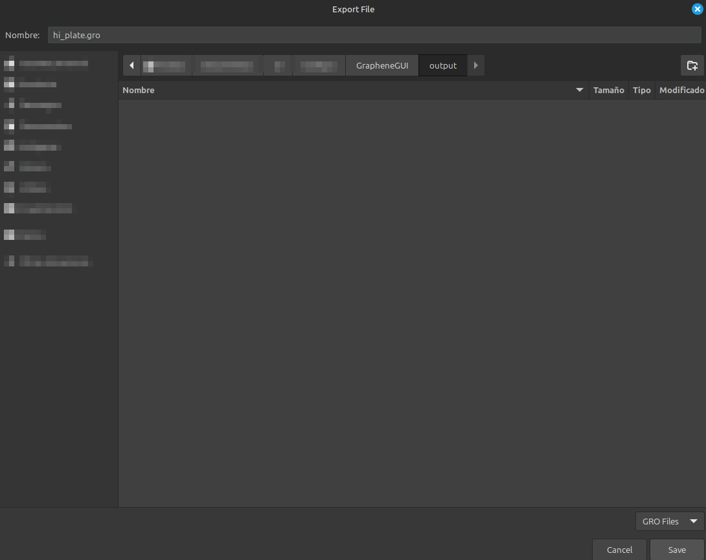
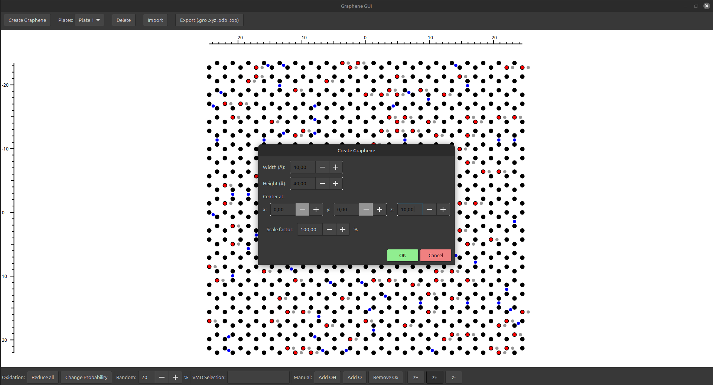
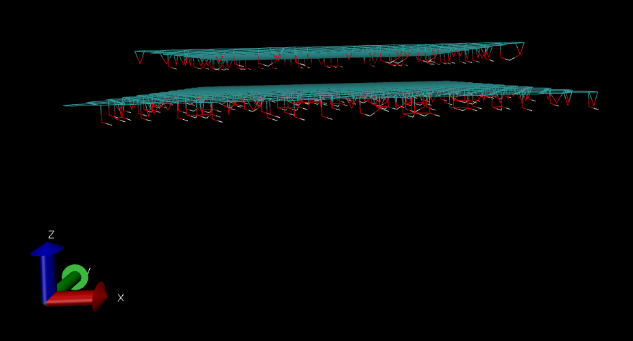

# Graphene GUI

**Graphene GUI** is a Qt (PySide6)-based graphical interface for creating and functionalizing graphene and graphene oxide slabs. It allows rapid construction, modification, and export of graphene structures for molecular simulations.

### Versión: 5.4

## 🧪 Purpose

The program's goal is to facilitate and accelerate the creation of customized graphene and oxidized graphene models, exportable in multiple formats compatible with simulation packages such as **GROMACS** and **AMBER**.

## 🖼️ Features

- Interactive creation of graphene slabs.
- Oxidation based on selection using Boolean expressions (VMD type) and random percentage.
- Manual addition and removal of oxide groups (OH and O).
- Multi-slab support for stacked systems.
- Export in formats:
  - `.gro` (GROMACS)
  - `.pdb` (standard PDB format)
  - `.xyz` (simple XYZ format)
  - `.top` (topology for GROMACS)
  - `.mol2` (MOL2 format for computational chemistry)
- Convert graphene to CNT (zigzag or armchair)
- Headless (CLI) mode: create, oxidize, roll into CNT, duplicate, and export
  driven by a YAML config file or one-off command-line overrides — no GUI needed.

## 🚀 Getting Started

### Prerequisites

- Python ≥ 3.6
- NumPy
- [PyYAML](https://pypi.org/project/PyYAML/) (needed for the headless CLI)
- [PySide6](https://pypi.org/project/PySide6/) (needed only for the graphical app — skip it if you only use the headless CLI)

## Installation on Linux

1. Clone the repository:

```bash
git clone https://github.com/nicolas-loubet/GrapheneGUI.git && cd GrapheneGUI/
```

2. Install the package (Python 3.8+):

```bash
pip install ".[gui]"
```

> Only using the headless CLI and don't need the graphical app? `pip install .` (without `[gui]`) skips the PySide6 dependency.

If you get an `error: externally-managed-environment` (Ubuntu 23.04+, Debian 12+, and other modern distros restrict system-wide pip installs per PEP 668), create a virtual environment first and install into that instead:

```bash
python3 -m venv graphene-gui-env && source graphene-gui-env/bin/activate && pip install ".[gui]"
```

3. Run it:

```bash
graphene-gui        # graphical app
graphene-gui-cli    # headless CLI
```

You can also install straight from GitHub without cloning first:

```bash
pip install "git+https://github.com/nicolas-loubet/GrapheneGUI.git#egg=GrapheneGUI[gui]"
```

### Running without installing

If you'd rather not install the package at all, just clone (or download) the
repository, install the dependencies, and run the module directly:

```bash
pip install -r requirements.txt
python3 -m graphenegui
```


## Installation on Windows

### 1) Download Python 3
Go to the official website:  
🔗 https://www.python.org/downloads/windows/  
Click on **Download Python 3.x.x** (choose the latest stable version).

### 2) Download the ZIP from GitHub
In the top-right corner of this page, click the green **Code** button, select **Download ZIP**, and save it on your computer (e.g., in your *Downloads* folder).

### 3) Extract the ZIP
Navigate to the folder where you saved the ZIP file.  
Right-click it, choose **Extract All**, and select your target destination (e.g., `C:\Users\<YourUser>\Documents\GrapheneGUI`).

### 4) Open the folder in Windows Terminal
Go to the extracted project folder.  
Right-click on an empty space inside the folder and choose **Open in Windows Terminal** (or **Open in PowerShell**, depending on your Windows version).

### 5) Continue with installation
Once the terminal is open in the project folder, run the following command to install dependencies:

```powershell
pip install -r requirements.txt
```

### 6) Run the project from the module
> Note: There is no main.py in the root directory. Instead, the application runs from the graphenegui module using __main__.py. Therefore, use:

```powershell
python -m graphenegui
```

If it fails, it could be that you need to use `py -m graphenegui` instead.

📌 Important: Make sure your terminal's current directory is the one containing graphenegui, requirements.txt, etc. For example:

```powershell
cd "C:\Users\<YourUser>\Documents\GrapheneGUI\GrapheneGUI-main\GrapheneGUI-main"
python -m graphenegui
```

## 🧭 Typical Workflow
1. Create a graphene plate via the `Create` button (+ sign).

2. Apply oxidation:

   - Use expressions like "x > 10 and y < 5" or equivalent to target specific atoms.

   - Control oxidation type (OH or O) and percentage.

3. Edit manually:

   - Add `OH` or `O` groups using the respective modes.

   - Remove existing oxide groups.

4. Add more plates if needed.

5. Export the system using the `Export` dialog and select .gro, .pdb, .xyz, .mol2, or .top.


## 🖥️ Headless mode (CLI)

Since v5.0, GrapheneGUI can also run without opening any window, driven by a
YAML config file and/or one-off overrides on the command line. Useful for
scripting and batch runs.

```bash
graphene-gui-cli -c config.yaml
graphene-gui-cli -c config.yaml --set plate.factor=1.2 --set export.output_dir=./output
```

It supports the same building blocks as the graphical app: plate creation,
oxidation by expression, CNT rolling, duplicates (multi-plate systems),
custom atom types, and export to any of the supported formats.

See [`headless_config_example.yaml`](headless_config_example.yaml) in the
repo for the full config schema and an example of every section.


## 📁 File Formats
- .gro: Atom positions and box for GROMACS.

- .pdb: Standard atom coordinates.

- .xyz: Simple atomic format for visualization.

- .mol2: Coordinates + Bond information

- .top: GROMACS-compatible topology with atoms, bonds, pairs, angles, and dihedrals.


## ⚙️ Internals
- Coordinates are stored in nanometers, presented in Å.

- Oxidation modes are determined by the Z direction:
  - +Z, -Z, or random.

- Atoms are classified with codes:
  - C → Carbon sp2
  - CE, CO → Carbon sp3
  - OE, OO → Oxygen
  - HO → Hydrogen

- `.mol2` export includes real per-atom partial charges (AMBER/GAFF-style, the
  same values used to build the `.top`), not a placeholder 0.0.


## 📜 License
This project is licensed under the GNU General Public License (GPL).


## 👤 Author
Nicolás Alfredo Loubet

Email: nicolas.loubet@uns.edu.ar


## 📸 Screenshots

| Step | Screenshot | Description |
|------|------------|-------------|
| 1 |  | Creating a new graphene plate with custom dimensions and center position. |
| 2 |  | A clean graphene sheet. You can see name and coordinates of each atom by placing the cursor over. |
| 3 |  | Applying oxidation using boolean expressions and random percentage. |
| 4 |  | Manually adding OH and O groups to selected atoms. |
| 5 |  | Export dialog for saving the system in `.gro`, `.pdb`, `.xyz`, or `.top` formats. |
| 6 |  | Adding multiple graphene plates to build stacked systems. |
| 7 |  | Rendering the exported structure using VMD for visualization. |


## 📦 Future ideas
- LAMMPS export support
- AMBER names compatibility
- More atoms / groups available
