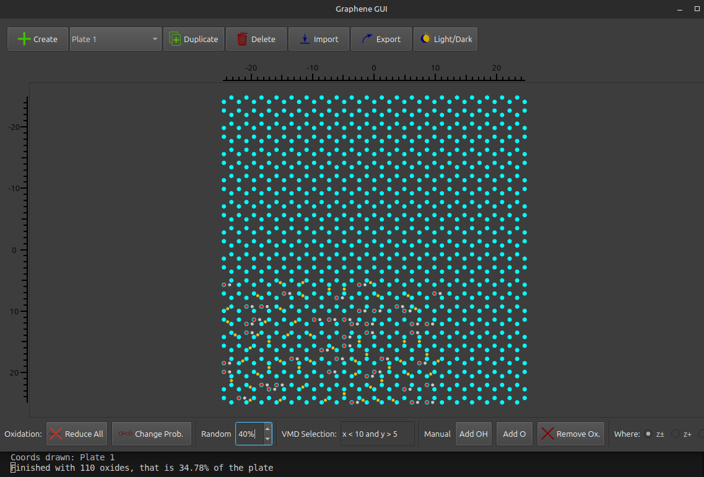
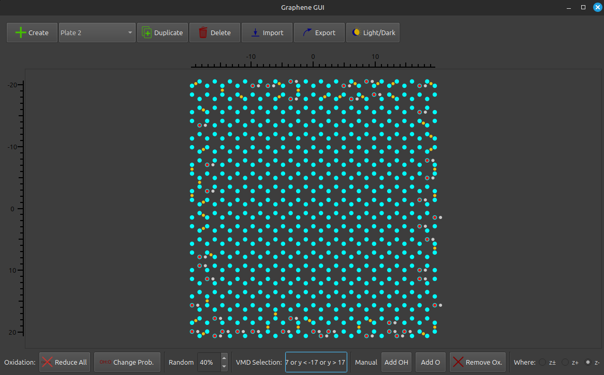

# Graphene GUI

**Graphene GUI** is a Qt (PySide6)-based graphical interface for creating and functionalizing graphene and graphene oxide slabs. It allows rapid construction, modification, and export of graphene structures for molecular simulations.

### Versión: 1.1

## 🧪 Purpose

The program's goal is to facilitate and accelerate the creation of customized graphene and oxidized graphene models, exportable in multiple formats compatible with simulation packages such as **GROMACS** and **AMBER**.

## 🖼️ Features

- Interactive creation of graphene slabs.
- Oxidation based on selection using Boolean expressions (VMD type) and random percentage.
- Manual addition and removal of oxide groups (OH and O).
- Multi-slab support for stacked systems.
- Export in formats:
  - `.gro` (GROMACS)
  - `.pdb` (standard PDB format)
  - `.xyz` (simple XYZ format)
  - `.top` (topology for GROMACS)
  - `.mol2` (MOL2 format for computational chemistry)

## 🚀 Getting Started

### Prerequisites

- Python ≥ 3.6
- [PySide6](https://pypi.org/project/PySide6/)
- NumPy

## Installation on Linux

### Option 1: Using pip (recommended if possible)


1. Clone the repository:

```bash
git clone https://github.com/nicolas-loubet/GrapheneGUI.git && cd GrapheneGUI/
```

2. Install requirements:

Make sure you have Python 3.8+ installed.

```bash
pip install -r requirements.txt
```

> **Note:** If you find an error at this point, try option 2.

3. Install the package using pip:

```bash
pip install .
```

4. After installation, run the program using:

```bash
graphene-gui
```

Alternatively, install directly from GitHub:

```bash
pip install git+https://github.com/nicolas-loubet/GrapheneGUI.git
```

And run with:

```bash
python3 main.py
```

### Option 2: If you get the "externally-managed-environment" error

On modern Linux distributions (Ubuntu 23.04+, Debian 12+, etc.), the system Python is externally managed according to PEP 668.
This means pip cannot install packages system-wide to avoid breaking the OS.

If you see an error like:

```bash
error: externally-managed-environment
× This environment is externally managed
```

You have some safe alternatives. I recommend creating a virtual environment.

This is the most flexible option and works everywhere.

```bash
python3 -m venv graphene-gui-env && source graphene-gui-env/bin/activate && pip install git+https://github.com/nicolas-loubet/GrapheneGUI.git
```

Then you just run it with

```bash
graphene-gui
```

### Option 3: Manual running

Also, you can just download the repository and run it:

```bash
python3 main.py
```


## Installation on Windows
Install Python 3 from [python.org](https://www.python.org/downloads/).

Open PowerShell or CMD in the project directory (or use cd to navigate to it).

Install dependencies:

```bash
pip install -r requirements.txt
```

Run the application:

```bash
python main.py
```

## 🧭 Typical Workflow
1. Create a graphene plate via the `Create` button (+ sign).

2. Apply oxidation:

   - Use expressions like "x > 10 and y < 5" or equivalent to target specific atoms.

   - Control oxidation type (OH or O) and percentage.

3. Edit manually:

   - Add `OH` or `O` groups using the respective modes.

   - Remove existing oxide groups.

4. Add more plates if needed.

5. Export the system using the `Export` dialog and select .gro, .pdb, .xyz, .mol2, or .top.


## 📁 File Formats
- .gro: Atom positions and box for GROMACS.

- .pdb: Standard atom coordinates.

- .xyz: Simple atomic format for visualization.

- .mol2: Coordinates + Bond information

- .top: GROMACS-compatible topology with atoms, bonds, pairs, angles, and dihedrals.


## ⚙️ Internals
- Coordinates are stored in nanometers, presented in Å.

- Oxidation modes are determined by the Z direction:
  - +Z, -Z, or random.

- Atoms are classified with codes:
  - C → Carbon sp2
  - CE, CO → Carbon sp3
  - OE, OO → Oxygen
  - HO → Hydrogen


## 📜 License
This project is licensed under the GNU General Public License (GPL).


## 👤 Author
Nicolás Alfredo Loubet

Email: nicolas.loubet@uns.edu.ar


## 📸 Screenshots

| Step | Screenshot | Description |
|------|------------|-------------|
| 1 |  | Creating a new graphene plate with custom dimensions and center position. |
| 2 |  | A clean graphene sheet. You can see name and coordinates of each atom by placing the cursor over. |
| 3 |  | Applying oxidation using boolean expressions and random percentage. |
| 4 |  | Manually adding OH and O groups to selected atoms. |
| 5 |  | Export dialog for saving the system in `.gro`, `.pdb`, `.xyz`, or `.top` formats. |
| 6 |  | Adding multiple graphene plates to build stacked systems. |
| 7 |  | Rendering the exported structure using VMD for visualization. |


## 📦 Future ideas
- LAMMPS export support
- AMBER names compatibility
- Auto add H in the borders
